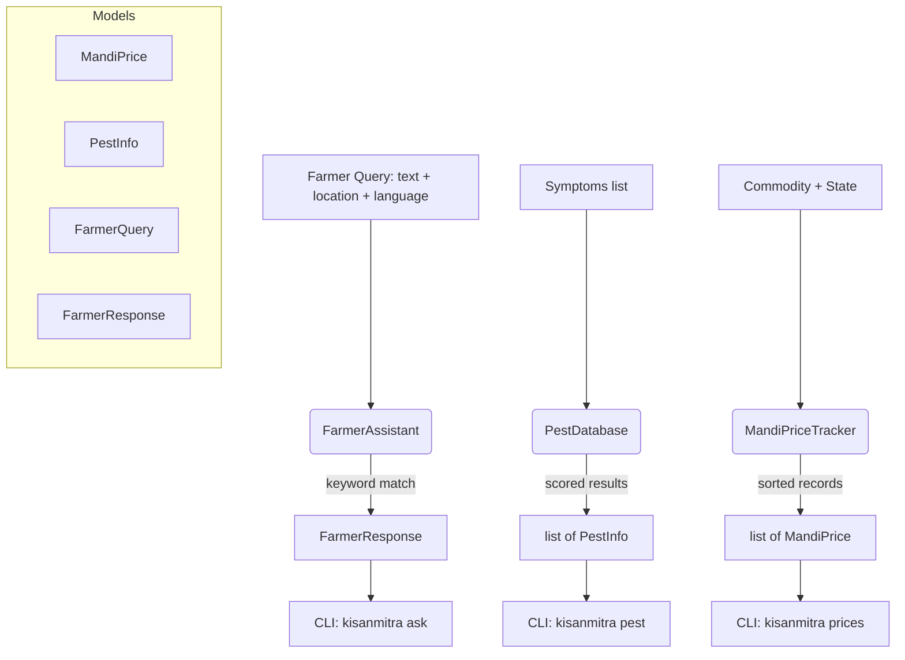

# aumai-kisanmitra

> Farmer mobile assistant for India — mandi prices, pest identification, government scheme advisory, and crop insurance guidance. Part of the [AumAI](https://github.com/aumai) open-source agentic infrastructure suite.

[](https://pypi.org/project/aumai-kisanmitra/)
[](https://www.python.org/downloads/)
[](LICENSE)
[](https://github.com/aumai/aumai-kisanmitra/actions)

---

> **AGRICULTURAL DISCLAIMER**
> This tool does not replace professional agronomic advice. Verify mandi prices with official
> AGMARKNET sources (agmarknet.gov.in). Pest identification results must be confirmed by local
> agricultural extension officers. Always consult your nearest Krishi Vigyan Kendra (KVK) or
> Block Agriculture Officer before taking action on any recommendation.

---

## What is KisanMitra?

"Kisan" means farmer. "Mitra" means friend.

KisanMitra is the interface layer between a farmer's question — asked in a field, on a phone,
through SMS or WhatsApp — and the information that should reach them within seconds:

- "What is today's wheat price in Lucknow mandi?"
- "My cotton leaves are turning yellow and sticky. What's wrong?"
- "How do I apply for PMFBY crop insurance?"

Before tools like KisanMitra, getting answers required knowing the right person to call,
speaking the right language, and having enough connectivity to navigate government portals.
Most farmers have none of those advantages.

KisanMitra encodes advisory responses, a 30+ pest database, mandi price tracking, and
government scheme guidance into open Python — embeddable in mobile apps, IVR systems, SMS
gateways, WhatsApp bots, or progressive web apps.

## Why Does This Matter?

India has approximately 120 million farm holdings. The vast majority are smallholders (under
2 hectares) who sell produce at local mandis, often without knowledge of prevailing prices at
larger markets. They also face pest and disease outbreaks with limited access to identification
and treatment information.

KisanMitra's first-principles design addresses three failure modes:

1. **Price opacity.** Farmers who don't know the mandi price at Azadpur or Nashik can't
   compare it against their local price. The `MandiPriceTracker` provides a queryable store
   for commodity prices with modal, min, and max values — ready to be populated from Agmarknet
   or eNAM APIs.
2. **Pest misidentification.** Wrong diagnosis leads to wrong pesticide, wasted money, and
   continued crop damage. The `PestDatabase` contains 30+ pests with observed symptoms,
   chemical treatments, and preventive measures — and provides a scored symptom-matching
   engine.
3. **Scheme ignorance.** PMFBY, PM-KISAN, and KCC go underutilised because farmers don't
   know eligibility or enrollment deadlines. `FarmerAssistant` surfaces scheme information
   in response to natural-language keyword queries.

## Architecture



**Three independent engines:**

- `MandiPriceTracker` — an in-memory store for mandi commodity price records. Designed to be
  populated from an Agmarknet or eNAM API feed and then queried by commodity and state.
- `PestDatabase` — a static catalogue of 30+ Indian agricultural pests with symptom-based
  identification via scored overlap matching.
- `FarmerAssistant` — a keyword-routing engine that maps farmer queries to curated advisory
  responses covering prices, fertilizers, irrigation, seeds, weather, loans, insurance, and MSP.

## Features

- **30+ Indian agricultural pests** covering insects, mites, fungi, bacteria, and nematodes
- **Symptom-based pest identification** with scored matching — top results ranked by symptom overlap
- **Per-crop pest filtering** — narrow results to pests affecting a specific crop
- **Mandi price tracker** with min/max/modal price, market name, state, and date
- **Price trend analysis** by commodity and market
- **Keyword-based farmer assistant** covering 9 advisory domains:
  - Mandi prices and eNAM
  - Pest and disease management
  - Fertilizer and soil health cards
  - Irrigation and PM Krishi Sinchayee Yojana
  - Seed variety selection
  - Weather and IMD agromet advisories
  - KCC and PM-KISAN credit schemes
  - PMFBY crop insurance
  - MSP and procurement portals
- **Multi-language response routing** — language code carried through responses
- **Location-aware responses** — location context appended to advisory answers
- **Pydantic v2 models** — safe at API and messaging boundaries
- **Apache 2.0 licensed** — embed in commercial agrotech products

## Quick Start

### Install

```bash
pip install aumai-kisanmitra
```

Or with `uv`:

```bash
uv add aumai-kisanmitra
```

### Python API

```python
from aumai_kisanmitra.core import FarmerAssistant
from aumai_kisanmitra.models import FarmerQuery

assistant = FarmerAssistant()
query = FarmerQuery(
    query="How do I apply for PMFBY crop insurance?",
    language="en",
    location="Amravati, Maharashtra",
)
response = assistant.respond(query)
print(response.answer)
print("\nSources:")
for source in response.sources:
    print(f"  - {source}")
```

### CLI — check mandi prices

```bash
kisanmitra prices --commodity wheat

kisanmitra prices --commodity rice --state UP
```

### CLI — identify a pest

```bash
kisanmitra pest --symptoms "yellow leaves,sticky honeydew,curling"

kisanmitra pest --symptoms "bored bolls,circular entry holes" --crop cotton
```

### CLI — ask a farming question

```bash
kisanmitra ask --query "What is Kisan Credit Card interest rate?"

kisanmitra ask --query "My crops are suffering from drought" \
  --location "Aurangabad, Maharashtra"
```

## CLI Reference

### `kisanmitra prices`

Display mandi prices for a commodity from the built-in sample dataset.

```
Usage: kisanmitra prices [OPTIONS]

Options:
  --commodity TEXT   Commodity name (e.g. rice, wheat, cotton)  [required]
  --state TEXT       Filter by state name (e.g. UP, Maharashtra)
  --help             Show this message and exit.
```

**Sample commodities in the built-in dataset:** rice, wheat, cotton, onion, potato.

**Example output:**

```
MANDI PRICES: RICE
Market               State           Min      Max    Modal Date
---------------------------------------------------------------------------
Azadpur              Delhi          1800     2200     2000 2026-02-27
Lucknow              UP             1750     2100     1950 2026-02-27
Patna                Bihar          1700     2050     1900 2026-02-27

(Prices in INR per quintal)
```

---

### `kisanmitra pest`

Identify pests from observed symptoms, optionally filtered by crop.

```
Usage: kisanmitra pest [OPTIONS]

Options:
  --symptoms TEXT    Comma-separated symptoms (e.g. 'yellow leaves,spots')  [required]
  --crop TEXT        Crop name to filter results
  --help             Show this message and exit.
```

**Example:**

```bash
kisanmitra pest --symptoms "yellowing,wilting,hopperburn" --crop rice
```

**Example output:**

```
PEST IDENTIFICATION RESULTS (1 match(es)):

==================================================
1. Brown Plant Hopper
   Affected Crops: Rice
   Symptoms: yellowing; wilting; hopperburn; lodging
   Treatment:
     - Apply imidacloprid 17.8 SL @ 125 ml/ha
     - Drain field for 3-4 days
     - Apply BPMC 50 EC
   Prevention:
     - Use resistant varieties
     - Avoid excessive nitrogen
     - Maintain field drainage
```

---

### `kisanmitra ask`

Get an advisory response to a natural-language farming question.

```
Usage: kisanmitra ask [OPTIONS]

Options:
  --query TEXT       Your farming question  [required]
  --location TEXT    Your location for context
  --language TEXT    Language code  [default: en]
  --help             Show this message and exit.
```

---

### `kisanmitra serve`

Start the KisanMitra API server (not yet implemented in v0.1.0).

---

## Python API Examples

### Load and query the pest database

```python
from aumai_kisanmitra.core import PestDatabase

db = PestDatabase()
print(f"Total pests in database: {len(db.all_pests())}")

# Symptom-based identification — returns pests sorted by symptom overlap score
results = db.identify(["yellowing", "sticky", "sooty mould"])
for pest in results[:3]:
    print(f"{pest.name}: {', '.join(pest.affected_crops)}")

# Filter by crop
cotton_pests = db.by_crop("cotton")
print(f"\nPests affecting cotton: {len(cotton_pests)}")
for pest in cotton_pests:
    print(f"  {pest.name}")
```

### Track and query mandi prices

```python
from aumai_kisanmitra.core import MandiPriceTracker
from aumai_kisanmitra.models import MandiPrice

tracker = MandiPriceTracker()

# Add price records (in production, populate from Agmarknet API)
tracker.add_price(MandiPrice(
    commodity="rice",
    market="Azadpur",
    state="Delhi",
    min_price=1800.0,
    max_price=2200.0,
    modal_price=2000.0,
    date="2026-02-27",
))

# Query all rice prices
all_rice = tracker.get_prices("rice")
print(f"Found {len(all_rice)} rice price records")

# Filter by state
up_rice = tracker.get_prices("rice", state="UP")

# Price trend for a specific market
trend = tracker.price_trend("rice", "Azadpur")
for record in trend:
    print(f"{record.date}: {record.modal_price} INR/quintal")
```

### Farmer assistant with location context

```python
from aumai_kisanmitra.core import FarmerAssistant
from aumai_kisanmitra.models import FarmerQuery

assistant = FarmerAssistant()

queries = [
    FarmerQuery(query="mandi price of onion", location="Nashik", language="en"),
    FarmerQuery(query="my wheat has yellow stripes", language="en"),
    FarmerQuery(query="kisan credit card loan rate", language="en"),
    FarmerQuery(query="flood forecast for my area", location="Patna", language="en"),
]

for q in queries:
    response = assistant.respond(q)
    print(f"Q: {q.query}")
    print(f"A: {response.answer[:120]}...")
    print(f"Sources: {response.sources}")
    print()
```

### Serialising responses for SMS/WhatsApp

```python
response = assistant.respond(query)

# Plain text for SMS
sms_text = response.answer[:320]

# JSON for a WhatsApp bot webhook payload
import json
payload = {
    "to": "+91-XXXXXXXXXX",
    "type": "text",
    "text": {"body": response.answer},
}
print(json.dumps(payload, indent=2))
```

## How It Works — Deep Dive

### MandiPriceTracker

The tracker stores `MandiPrice` records in an in-memory list. `get_prices()` performs a
case-insensitive filter on commodity and optional state, then sorts results by date descending
so the latest price appears first. `price_trend()` filters by both commodity and market,
then sorts ascending for chronological trend analysis.

In production, populate the tracker from the Agmarknet API or eNAM data feed before each
query cycle.

### PestDatabase

The database contains 30+ pest entries covering: insects (hoppers, borers, aphids, whiteflies,
thrips, mites, mealybugs, caterpillars), fungi (blast, rust, blight, mildew, downy mildew),
bacteria (bacterial wilt), and nematodes.

`identify()` computes a scored overlap between the provided symptom keywords and each pest's
symptom list. The score is the count of user symptoms that appear as substrings in any of the
pest's recorded symptoms. Results are returned in descending score order.

`by_crop()` does a case-insensitive exact match on `PestInfo.affected_crops`.

### FarmerAssistant

The assistant uses a keyword priority table of nine topic categories. For each incoming query,
it counts how many keywords from each category appear in the query text, selects the
highest-scoring category, and returns the corresponding curated answer and source list.

If the query scores zero on all categories, a fallback generic response is returned. If a
`location` is provided in `FarmerQuery`, it is appended to the answer with a suggestion to
contact the local Block Agriculture Officer or KVK.

The design is intentionally rule-based — no LLM inference, no network calls. This means it
works offline, on low-end servers, and within the latency constraints of SMS gateways.

## Integration with Other AumAI Projects

| Project              | Integration point |
|----------------------|-------------------|
| **aumai-farmbrain**  | FarmBrain's `CropAdvisory` can be surfaced through KisanMitra's `FarmerAssistant` when crop-specific fertilizer or irrigation questions are detected. |
| **aumai-climatewatch** | ClimateWatch weather alerts can be injected into KisanMitra responses when weather-related keywords are detected. |

Example bridge — routing weather queries to ClimateWatch:

```python
from aumai_kisanmitra.models import FarmerQuery
from aumai_climatewatch.core import ClimateZoneRegistry

query = FarmerQuery(query="Will there be floods in Bihar this week?")

if any(kw in query.query.lower() for kw in ["flood", "rain", "weather"]):
    registry = ClimateZoneRegistry()
    zones = registry.zones_for_state("Bihar")
    # Continue with ClimateWatch alert evaluation...
```

## Contributing

Please read [CONTRIBUTING.md](CONTRIBUTING.md) and [AGENTS.md](AGENTS.md) before opening a
pull request.

Quick checklist:
- Run `make lint` (ruff + mypy) before pushing.
- Run `make test` and ensure all tests pass.
- New pest entries must cite an ICAR, state agriculture department, or CABI source.
- New government scheme entries must include the official portal URL.

## License

Apache License 2.0. See [LICENSE](LICENSE) for details.

Copyright 2024 AumAI Contributors.
